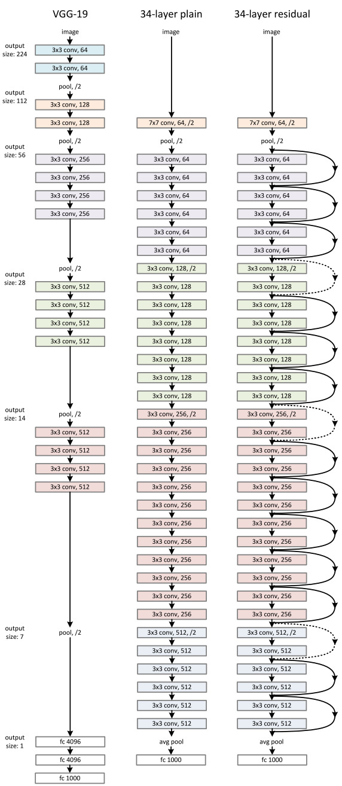

# Deep Residual Learning for Image Recognition

- Eases the training of networks that are very deep
- Layers learn residual functions with reference to the layer inputs, instead of learning unreferenced functions

