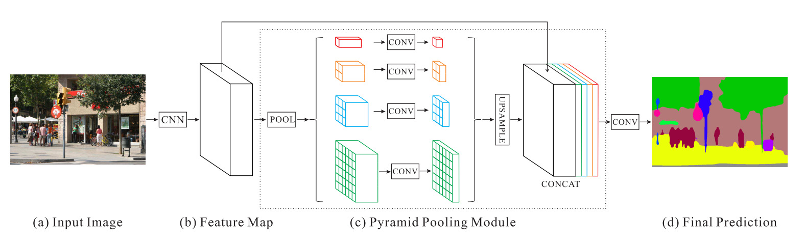

# Pyramid Scene Parsing Network (Zhao et. al)

- Scene parsing, pixel-level prediction
- Incorporation of global prior representation (pyramid pooling module)
- State-of-the-art performance on multiple datasets

